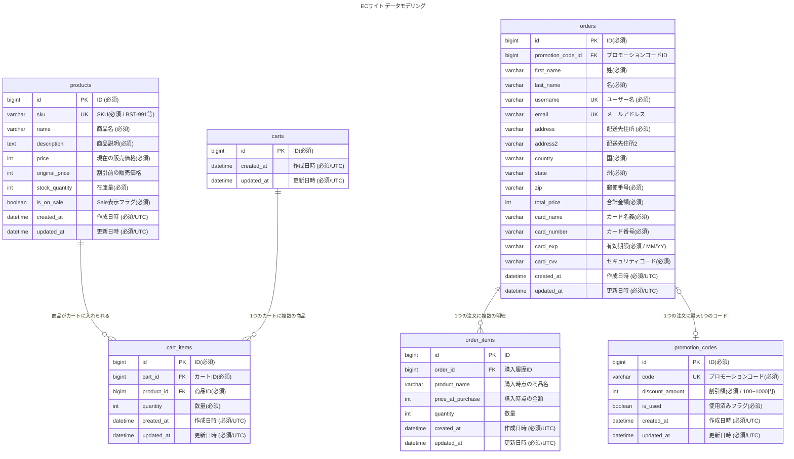

```mermaid
---
title: "ECサイト データモデリング"
---

erDiagram
    products ||--o{ cart_items : "商品がカートに入れられる"
    carts ||--o{ cart_items : "1つのカートに複数の商品"
    orders ||--o{ order_items : "1つの注文に複数の明細"
    orders |o--o| promotion_codes : "1つの注文に最大1つのコード"

    %% 商品情報
    products {
      bigint id PK "ID (必須)"
      varchar sku UK "SKU(必須 / BST-991等)"
      varchar name "商品名 (必須)"
      text description "商品説明(必須)"
      int price "現在の販売価格(必須)"
      int original_price "割引前の販売価格"
      int stock_quantity "在庫量(必須)"
      boolean is_on_sale "Sale表示フラグ(必須)"
      datetime created_at "作成日時 (必須/UTC)"
      datetime updated_at "更新日時 (必須/UTC)"
    }

    %% カート（セッション管理）
    carts {
      %% 将来usersテーブルを追加した場合はこのエンティティにuser_idを追加する
      bigint id PK "ID(必須)"
      datetime created_at "作成日時 (必須/UTC)"
      datetime updated_at "更新日時 (必須/UTC)"
    }

    %% カート内商品
    cart_items {
      bigint id PK "ID(必須)"
      bigint cart_id FK "カートID(必須)"
      bigint product_id FK "商品ID(必須)"
      int quantity "数量(必須)"
      datetime created_at "作成日時 (必須/UTC)"
      datetime updated_at "更新日時 (必須/UTC)"
    }

    %% 購入履歴
    orders {
      %% 将来usersテーブルを追加した場合はこのエンティティにuser_idを追加する
      bigint id PK "ID(必須)"
      bigint promotion_code_id FK "プロモーションコードID"
      varchar first_name "姓(必須)"
      varchar last_name "名(必須)"
      varchar username UK "ユーザー名 (必須)"
      varchar email UK "メールアドレス"
      varchar address "配送先住所 (必須)"
      varchar address2 "配送先住所2"
      varchar country "国(必須)"
      varchar state "州(必須)"
      varchar zip "郵便番号(必須)"
      int total_price "合計金額(必須)"
      varchar card_name "カード名義(必須)"
      varchar card_number "カード番号(必須)"
      varchar card_exp "有効期限(必須 / MM/YY)"
      varchar card_cvv "セキュリティコード(必須)"
      datetime created_at "作成日時 (必須/UTC)"
      datetime updated_at "更新日時 (必須/UTC)"
    }

    %% 購入明細
    order_items {
      bigint id PK "ID"
      bigint order_id FK "購入履歴ID"
      varchar product_name "購入時点の商品名"
      int price_at_purchase "購入時点の金額"
      int quantity "数量"
      datetime created_at "作成日時 (必須/UTC)"
      datetime updated_at "更新日時 (必須/UTC)"
    }

    %% プロモーションコード
    promotion_codes {
      bigint id PK "ID(必須)"
      varchar code UK "プロモーションコード(必須)"
      int discount_amount "割引額(必須 / 100~1000円)"
      boolean is_used "使用済みフラグ(必須)"
      datetime created_at "作成日時 (必須/UTC)"
      datetime updated_at "更新日時 (必須/UTC)"
    }


```
